# 
FluEvent Etkinlik App 
 
>##  
FluEvent ile tüm kapılar açılır 
 
#
## 
Takım Üyeleri 
 
- > [Gökhan Birkin](https://github.com/sgokhanbirkin)
- > [Berkay Ergün](https://github.com/Berkayergun16)
- > [Berna Demir](https://github.com/bernademir)
- > [Mesud Karakayalı](https://github.com/mesud07)
#
> #  
FluEvent, etkinlik olusturabileceginiz ve etkinliklere katılım saglayabileceginiz bir uygulamadır. 
  
# Çözümlerimiz
## 
- Uygulamamızda çocukların kişisel gelişimlerine ve eğitimlerine katkı sağlayacak etkinliklerden haberdar olmasını sağlıyoruz. Aileler FluEvent üzerinden bu etkinlikleri görebilir ve maddi bir sıkıntı çekmeden çocuklarını etkinliklere dahil edebilirler. Bu sayede her çocuğun eşit şartlarda sosyalleşmesini sağlıyoruz.

- Uygulamamız yeni mezun, iş arayışında olan, kariyerini planlayan ve sektör hakkında bilgi sahibi olmak isteyen kişilerin bir araya gelerek firmalara ziyaretlerde bulunabilecekleri etkinlikleri kapsayacak. Katılan kişiler hem firmalar hakkında bilgi sahibi olabilecek hem de kendilerine uygun iş fırsatları yakalayabilecekler. 

- Uygulamamızın sonraki versiyonunda firma sponsorlukları olacak. Firmalar etkinliklere ekleyeceğimiz bilet satışlarına sponsor olacak ve askıya etkinlik bileti bırakacaklar. Böylece hem kendilerini tanıtacaklar, hem de sponsor oldukları etkinlikler insanlara ücretsiz olarak sunulmuş olacak.

- Uygulamamızda sadece firmalar değil, kullanıcılar da etkinlik açabiliyor. Böylece kendi ilgi alanlarına sahip başka insanlarla bir araya gelebilecek ve bir topluluğa dahil olarak kendilerini geliştirebilecekler. 
#
# Hedef Kitle
- İstihdam ihtiyacı olan kişiler
- Yeni mezun gençler
- Okul öncesinden başlamak üzere eğitim alan çocuklar
- Sosyalleşmek, ve kendini geliştirmek isteyen herkes

#
# 
Ekran görüntüleri
 

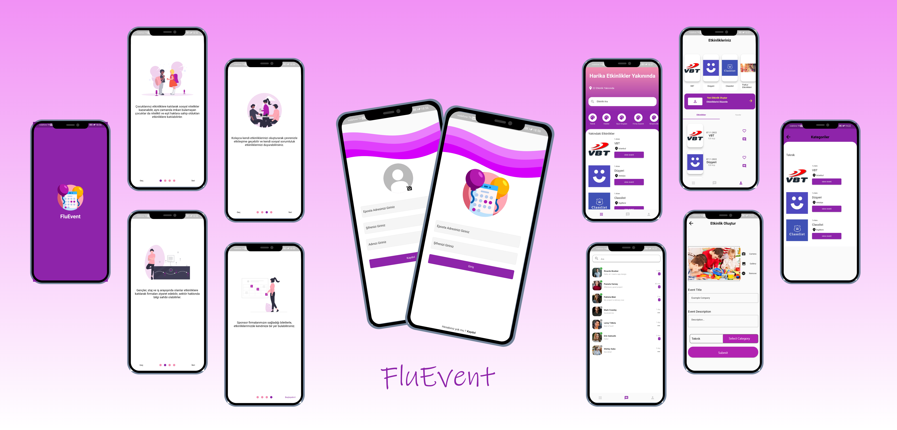</img>

 

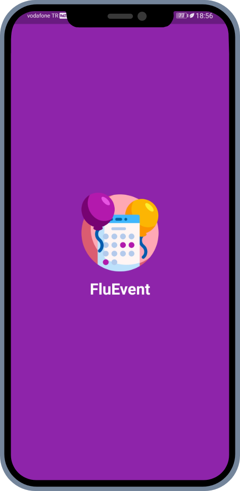</img>
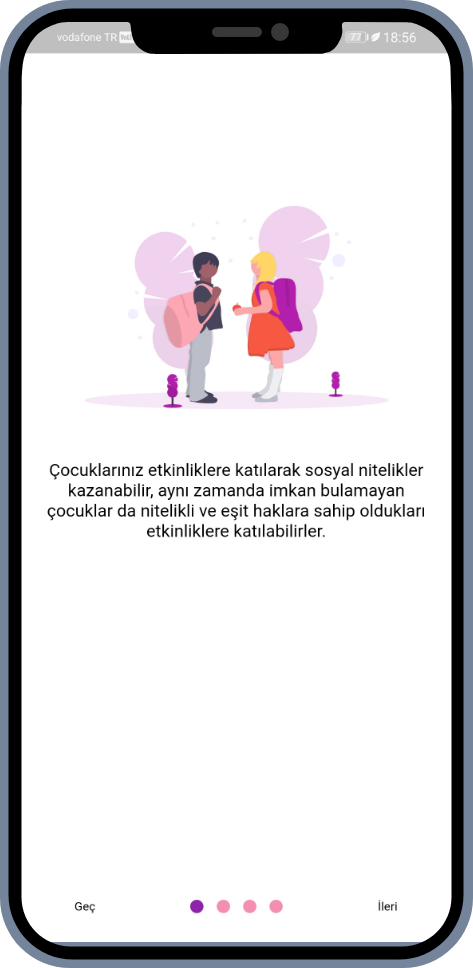</img>

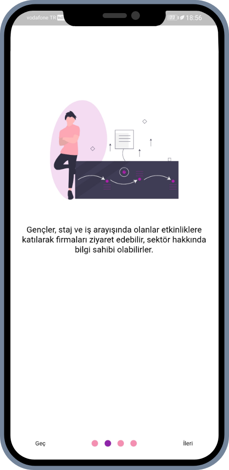</img>
</img>

 
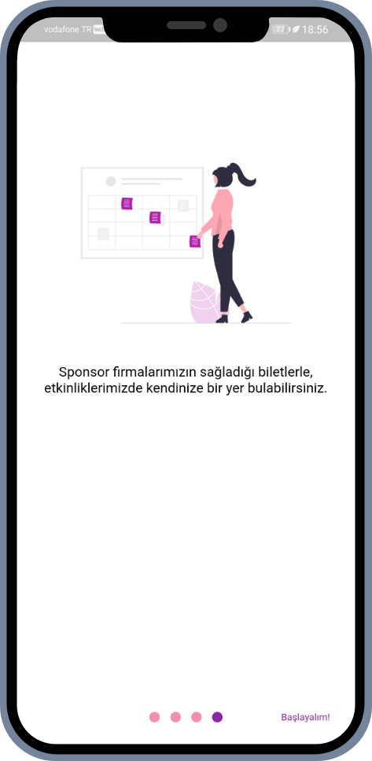</img>
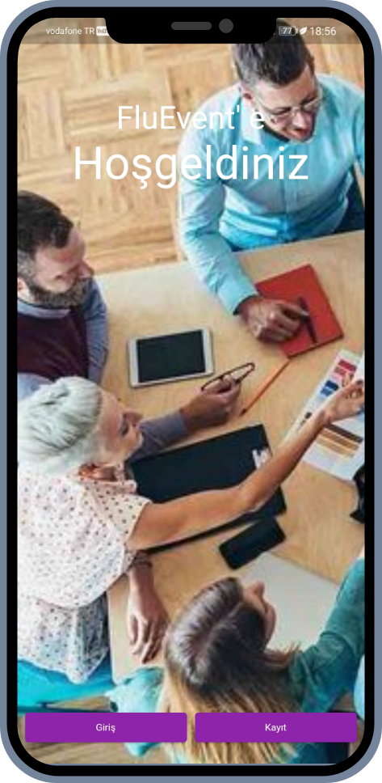</img>

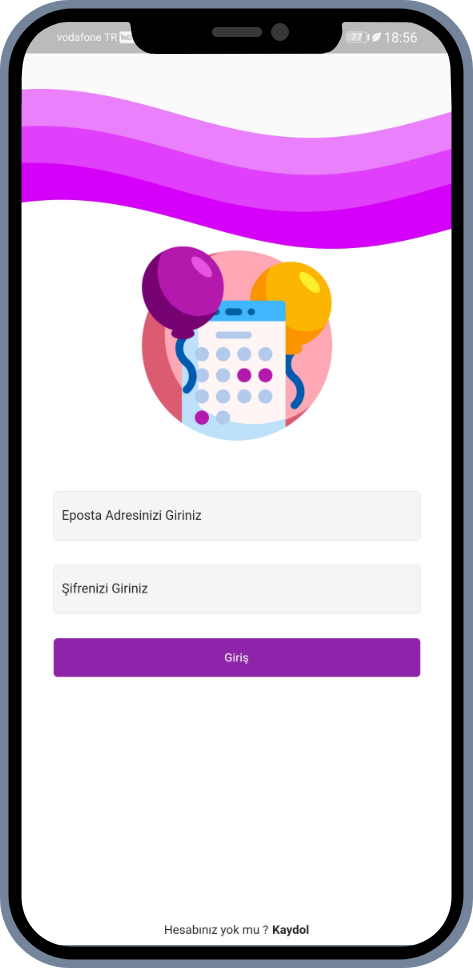</img>
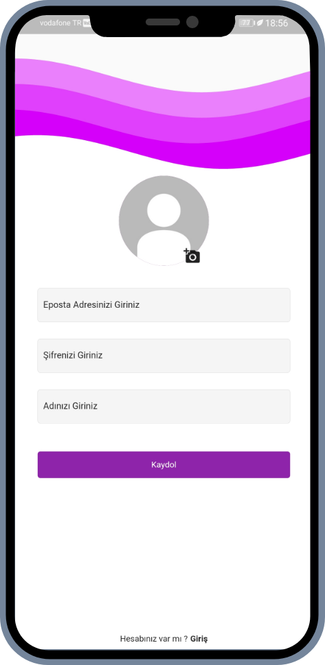</img>

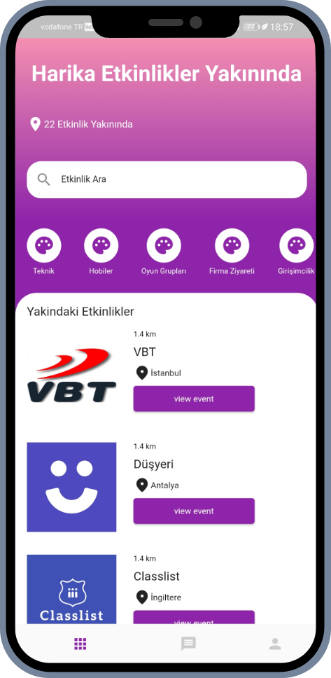</img>
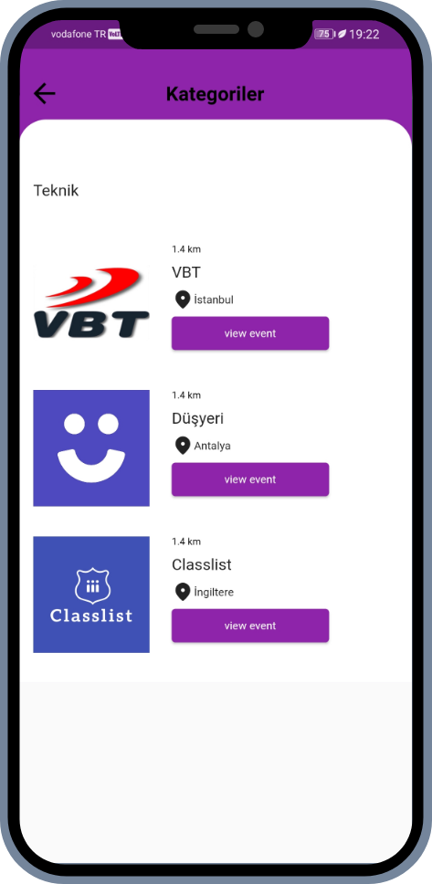</img>

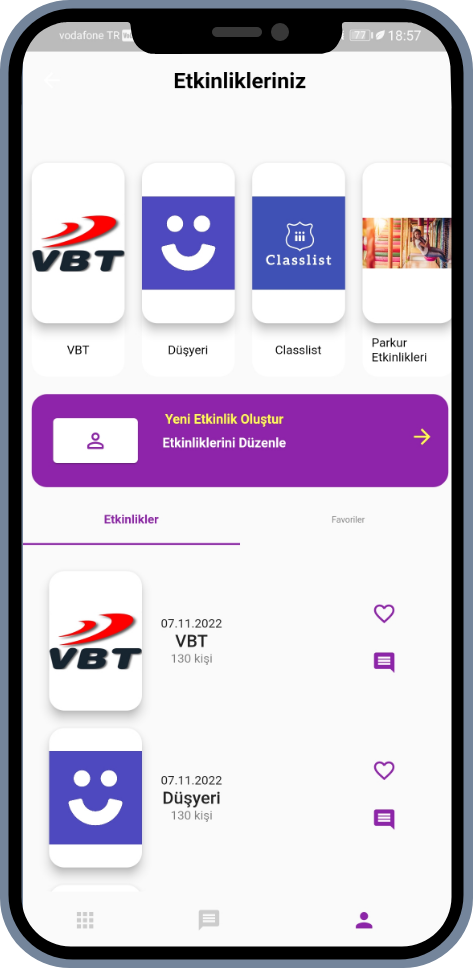</img>
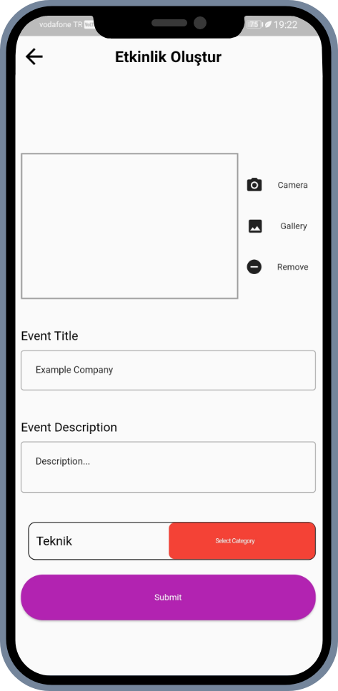</img>
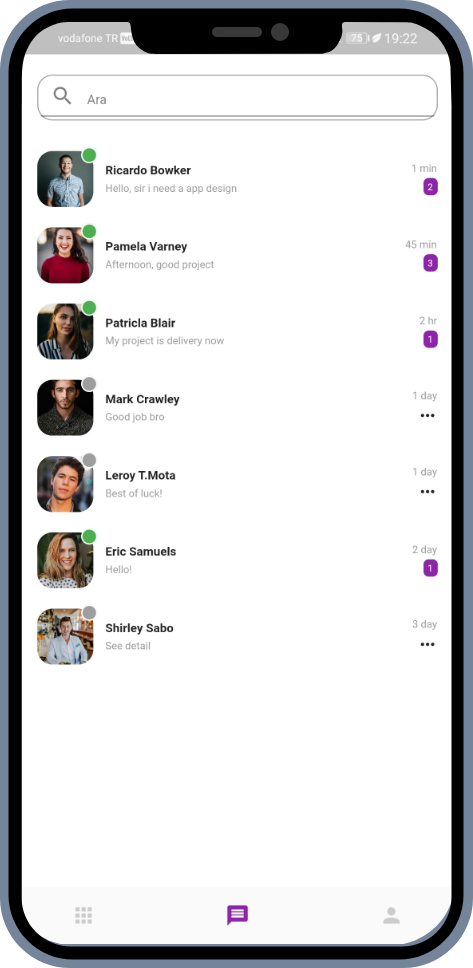</img>

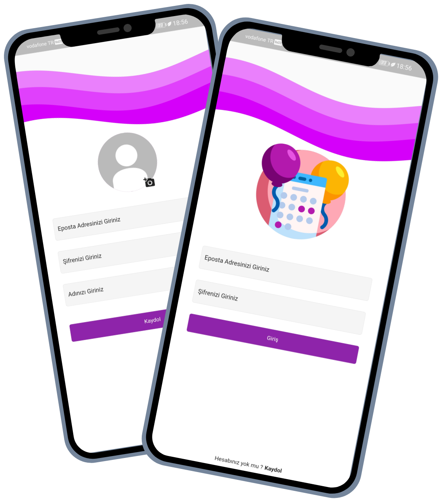</img>

