# Copy-Pase
# FluEvent Etkinlik App
### Projeyi indirdikten sonra, flutter pub get yapıp sorunsuzca çalıştırabilirsiniz.
### Ekran görüntüleri

- 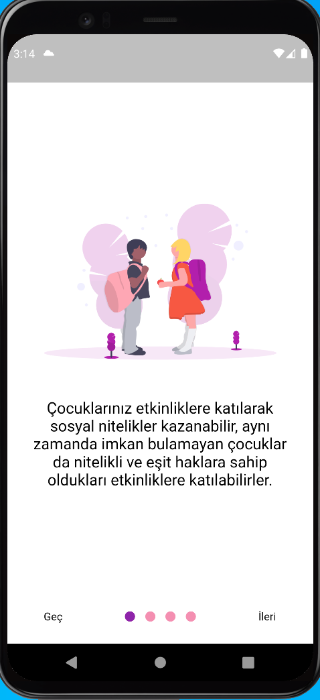</img>
- 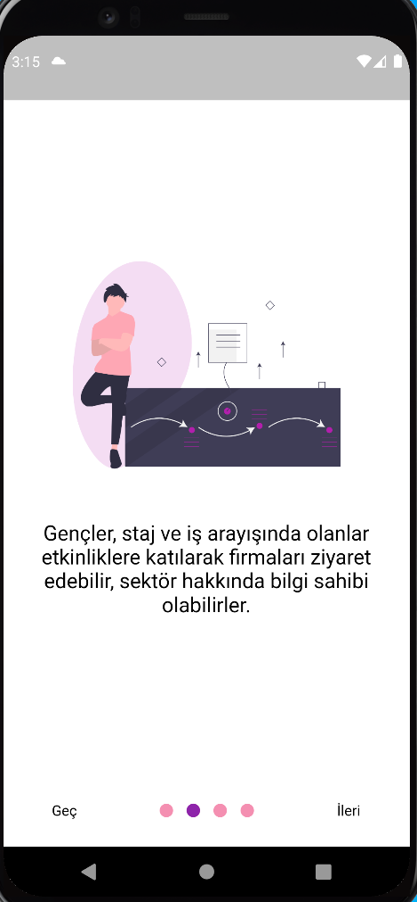</img>

- 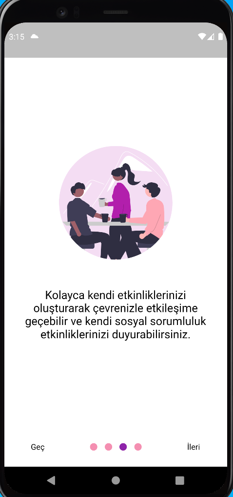</img>
- 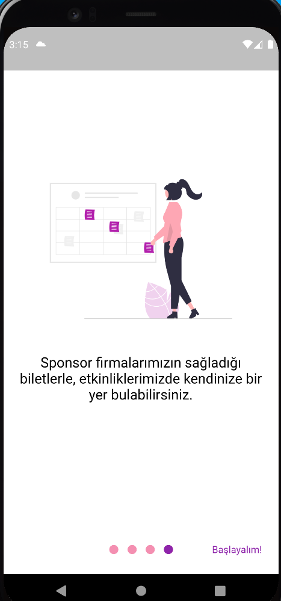</img>

- </img>
- 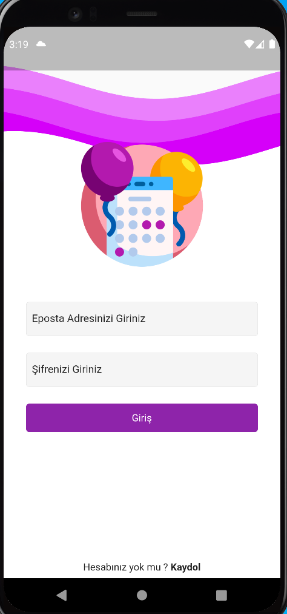</img>

- 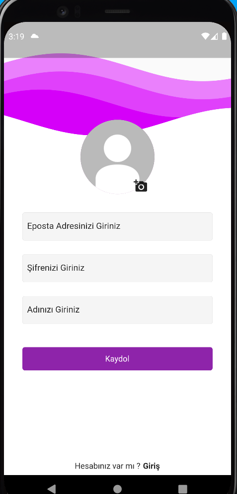</img>
- 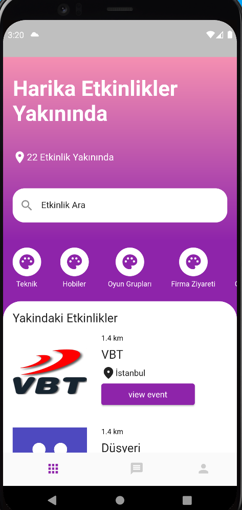</img>

- 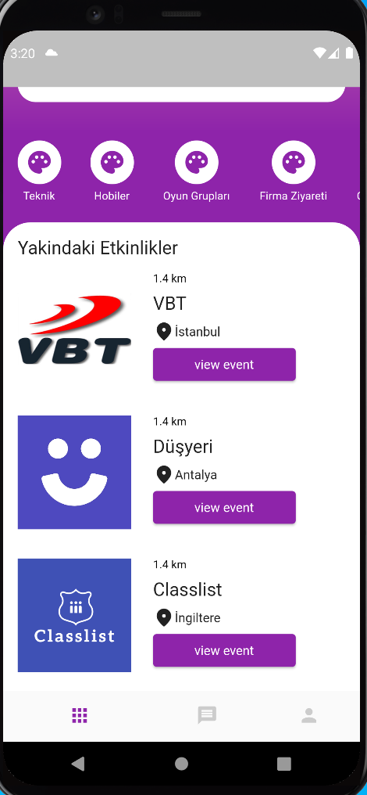</img>
- 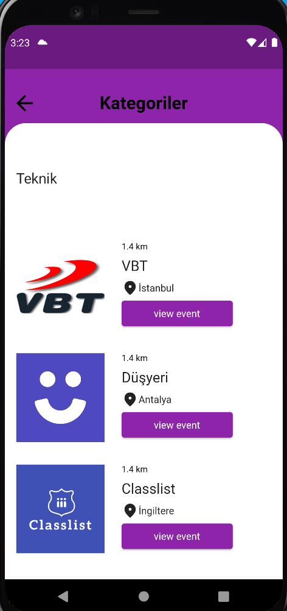</img>

- 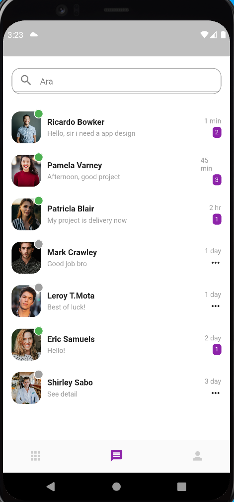</img>
- 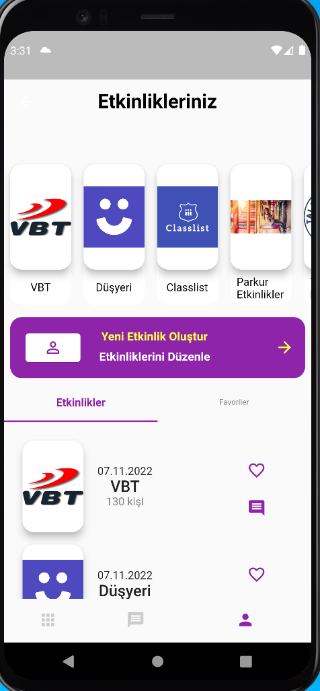</img>

- 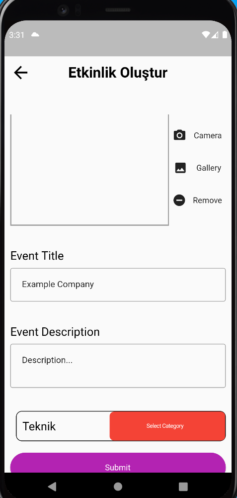</img>

- </img>
- </img>
- </img>
